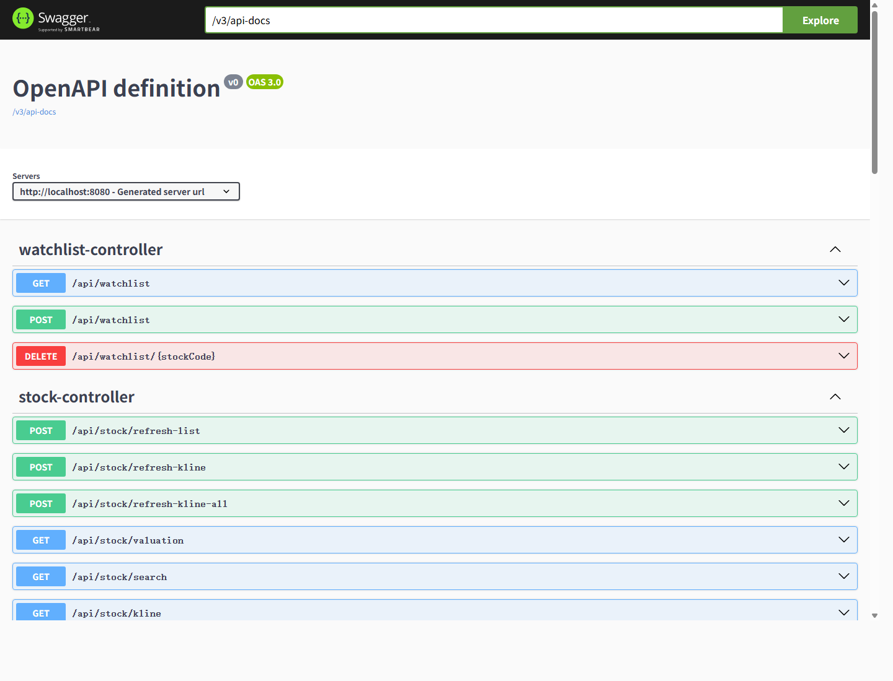

# 港股分析应用

一个本地运行的港股分析工作台，包含股票搜索、K 线/技术指标、自选股、价格预警、新股表现统计、新股 AI 分析、财报/分红日历和 AI 模型配置。

## 功能概览

- **大盘概览**：展示港股市场概览数据。
- **股票搜索**：按代码/名称搜索港股。
- **股票详情**：K 线、技术指标、估值、新闻和 AI 分析入口。
- **自选股**：维护关注列表，查看最新行情和估值信息。
- **新股 AI 分析**：即将上市、近一年新股对比、板块统计、破发率、单只新股 AI 报告。
- **日历**：财报、分红和市场事件。
- **价格预警**：设置价格条件并定时检查。
- **设置**：配置 OpenAI-compatible / MiniMax / Xiaomi MiMo / DeepSeek / Qwen 等模型。

## 技术栈

| 模块 | 技术 |
| --- | --- |
| 前端 | Vue 3 + Vite + Element Plus + ECharts |
| 后端 | Java 17 + Spring Boot 3.2 + MyBatis-Plus |
| AI 微服务 | Python FastAPI + httpx + akshare |
| 数据库 | PostgreSQL |
| 数据源 | Futu OpenD、AKShare、AAStocks/新闻爬虫 |

## 项目结构

```text
hk-stock-app/
├── backend/              # Java Spring Boot 后端
│   ├── pom.xml
│   └── src/main/
│       ├── java/com/hkstock/
│       │   ├── HkStockApplication.java    # 后端启动类
│       │   ├── controller/                # REST API 接口层
│       │   ├── service/                   # 业务逻辑层
│       │   ├── mapper/                    # MyBatis-Plus 数据库访问层
│       │   ├── entity/                    # 数据表实体类
│       │   ├── config/                    # Spring 配置
│       │   └── task/                      # 定时同步/预警任务
│       └── resources/
│           ├── application.yml            # 本地配置，使用环境变量占位
│           ├── application.example.yml    # 示例配置，可安全提交
│           └── schema.sql                 # 数据库建表脚本
│
├── frontend/             # Vue 前端
│   ├── package.json
│   ├── vite.config.js
│   ├── index.html
│   └── src/
│       ├── main.js
│       ├── App.vue
│       ├── router/index.js
│       └── views/                         # 页面组件
│
├── ai-service/           # Python FastAPI AI 微服务
│   ├── requirements.txt
│   └── app/
│       ├── main.py
│       └── routers/
│           ├── analyze.py                 # AI 分析和 LLM 调用
│           ├── scraper.py                 # 数据/新闻抓取接口
│           └── config.py                  # AI 配置接口
│
├── docker/               # Docker 初始化脚本
├── docker-compose.yml    # PostgreSQL + 后端 + AI 服务 + 前端一键启动
├── requirements-sync.txt # 同步脚本在 Docker 内需要的 Python 依赖
├── scripts / root *.py   # 同步、爬虫、修复、测试脚本（开发期工具）
├── .env.example          # 环境变量示例，不要填写真实密钥后提交
├── .gitignore            # GitHub 上传忽略规则
├── requirements.md       # 原始需求文档
└── README.md
```

## Docker Compose 一键启动

项目根目录已提供 `docker-compose.yml`，面试官 clone 后可以直接一键启动 PostgreSQL、Spring Boot 后端、FastAPI AI 服务和 Vue 前端。

### 最短启动

```bash
docker compose up -d
```

首次启动如果本地没有镜像，Docker Compose 会按各模块 Dockerfile 自动构建。需要强制重建时再执行：

```bash
docker compose up -d --build
```

### 端口说明

```text
frontend:   http://localhost:3000
backend:    http://localhost:8080
ai-service: http://localhost:8082
postgres:   localhost:5432 / hk_stock
Swagger:    http://localhost:8080/swagger-ui.html
```

### 可选：准备本地环境变量

不创建 `.env` 也能用默认值启动；如需修改数据库密码、Futu OpenD 地址或端口，可复制示例文件：

```bash
copy .env.example .env
```

常用配置：

```env
POSTGRES_DB=hk_stock
POSTGRES_USER=postgres
POSTGRES_PASSWORD=your_database_password
FUTU_OPEND_HOST=host.docker.internal
FUTU_OPEND_PORT=11111
```

## 接口文档

后端集成了 Swagger / OpenAPI UI，启动后访问：

```text
http://localhost:8080/swagger-ui.html
```

截图：



常用命令：

```bash
# 查看容器状态
docker compose ps

# 查看日志
docker compose logs -f

# 停止服务
docker compose down

# 停止并删除数据库数据卷（会清空数据）
docker compose down -v
```

> 首次启动会自动执行 `docker/postgres/01_schema.sql` 初始化表结构。已有数据卷不会重复初始化；如果改了初始化 SQL 并想重建空库，需要先执行 `docker compose down -v`。

## 本地启动

### 1. 准备 PostgreSQL

创建数据库：

```bash
createdb -U postgres hk_stock
```

初始化表结构：

```bash
psql -U postgres -d hk_stock -f backend/src/main/resources/schema.sql
```

### 2. 配置环境变量

复制示例文件：

```bash
copy .env.example .env
```

然后按本机环境填写：

```env
DB_URL=jdbc:postgresql://localhost:5432/hk_stock
DB_USER=postgres
DB_PASSWORD=your_database_password
AI_SERVICE_URL=http://localhost:8082
PYTHON_EXECUTABLE=python
APP_SCRIPT_ROOT=..
```

> 注意：Spring Boot 不会自动读取根目录 `.env`。你可以在 IDEA 运行配置里填这些环境变量，或者直接在系统环境变量里配置。

### 3. 启动后端

```bash
cd backend
mvn spring-boot:run
```

后端默认地址：

```text
http://localhost:8080
```

### 4. 启动 AI 微服务

```bash
cd ai-service
pip install -r requirements.txt
uvicorn app.main:app --port 8082 --reload
```

AI 微服务默认地址：

```text
http://localhost:8082
```

### 5. 启动前端

```bash
cd frontend
npm install
npm run dev
```

前端默认地址：

```text
http://localhost:3000
```

## 常用验证命令

前端构建：

```bash
cd frontend
npm run build
```

后端编译：

```bash
cd backend
mvn -DskipTests compile
```

AI 微服务健康检查：

```bash
curl http://localhost:8082/health
```

## 重要代码入口

- 新股页面：`frontend/src/views/IPO.vue`
- 新股接口：`backend/src/main/java/com/hkstock/controller/IpoController.java`
- 新股业务：`backend/src/main/java/com/hkstock/service/IpoService.java`
- AI 配置服务：`backend/src/main/java/com/hkstock/service/ConfigService.java`
- 定时任务：`backend/src/main/java/com/hkstock/task/ScheduledTasks.java`
- AI 分析：`ai-service/app/routers/analyze.py`
